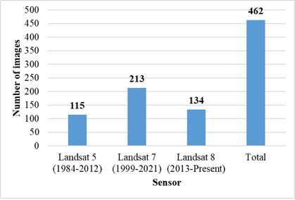
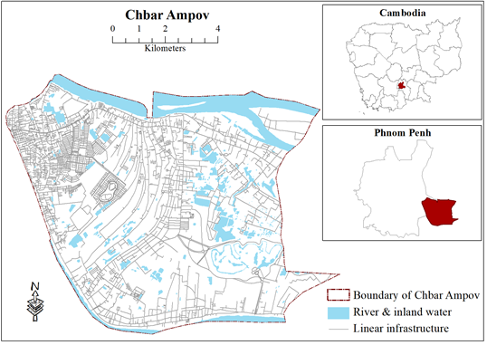
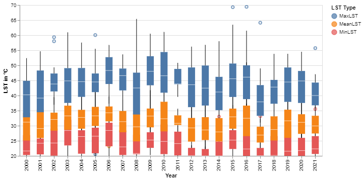

# Land surface temperature dynamics in a changing landscape: A time series analysis of land surface temperature data in Google Earth Engine

## 1. About the study
This study investigates the spatiotemporal patterns of land surface temperature (LST) and
its relationship with land use/land cover (LULC) changes in an urban setting. The main
objectives were to analyse seasonal variability, LST trends, and the response of LST to
different LULC types in identified hotspots, including the correlation between them. A
mixed-methods approach was employed, utilising remote sensing techniques and Landsat
Land surface temperature data to collect regional data. The sample included 462 images
of the Chbar Ampov District (Phnom Penh, Cambodia) taken from 2000 to 2021, which
were analysed using the cloud-based platform Google Earth Engine (GEE). The findings
revealed noticeable seasonal variability in LST and a visual connection between LST and
LULC changes in specific hotspots. No long-term trends in LST were observed, despite
fluctuations up to 49 °C. A strong positive correlation between built-up areas and LST
was identified, while negative correlations were found between LST and water bodies
and vegetation. These results support the notion that urbanisation, land sealing and LULC
changes are closely related to LST variations, emphasising the importance of considering
local context and specific LULC changes when examining LST dynamics. The findings
can inform urban planning and management strategies, such as incorporating green and
blue infrastructure to moderate LST values and improve the urban environment. This
study provides valuable insights into LST dynamics and the relationship between LST
and LULC changes, with potential implications for urban planners, policymakers, and
researchers working towards creating more sustainable and resilient urban environments.

## 2. Remote sensing data used on the study
The study primarily used the Landsat data for LST estimation and calculating different
spectral indices. This study used collection-1: Tier 1 data from Landsat 5, 7 and 8. Both
surface reflectance (SR) and calibrated top-of-atmosphere (TOA) data were used. The images 
in Phnom Penh is highly susceptible to the presence of cloud. Hence, a
maximum of 60% cloud filter is applied. The cloud coverage of the selected images is
presented in the following chart (Figure 1). Each dot represents an image that was
considered for this study. After applying the cloud filter, 462 images were found from
2000 to 2021

Figure 1: [Cloud coverage in the Landsat images selected for the study](https://mohigeo33.github.io/lst_timeseries/cloud_cover.html).

Figure 2: Sensor-wise number of Landsat images for the period of 2000 to 2021 (60% maximum cloud filter applied)

## 3. Study area
Chbar Ampov District, located in the southeast region of Phnom Penh, Cambodia, is a rapidly developing urban area 
with a mix of residential and commercial zones (City of Phnom Penh, 2020). The Mekong River borders the district to 
the east, Meanchey District to the west, Kandal Province to the north, and Prek Pnov District to the south (Figure 3).

Figure 3: Location of the study area

## 4. LST estimation and spectral indices calculation
Following steps were taken to estimate the LST and calculate the spectral indices from Landsat images (Figure 4)

Figure 4: LST estimation and spectral indices calculation from Landsat images

## 5. Highlighted results

Figure 5: [Calendar heatmaps of Mean LST](https://mohigeo33.github.io/lst_timeseries/calendar_MeanLST.html).

Figure 6: [Calendar heatmaps of Maximum LST](https://mohigeo33.github.io/lst_timeseries/calendar_MaxLST.html).

Figure 7: [Calendar heatmaps of Minimum LST](https://mohigeo33.github.io/lst_timeseries/calendar_MinLST.html).

Figure 8: Annual LST range (2000 - 2021)

Figure 9: Number of warmer months per year in LST categories
(The height of each bar represents the warmth score for respective years.)

Figure 10: [Total time series of minimum, mean & maximum LST (2000 - 2021)](https://mohigeo33.github.io/lst_timeseries/LST_trend.html).

Figure 11: Correlation matrix between LST, IBI, MNDWI & NDVI

## 6. Notebook (Code) files and their description
a) LST_Calculation.ipynb: Image pre-processing, Spectral indices calculation, LST estimation and statistical data extraction

b) Statistical_analysis.ipynb: Descriptive statistics, trend and correlation analysis

## 7. Files needed to run the code externally (downloadable from the repository)
a) AOI.zip: the shapefile for area of interest

b) CSV files.zip: the csv files required for statistical analysis

## 8. Remarks
This code is created for research purposes. Upon use please provide appropriate references.

